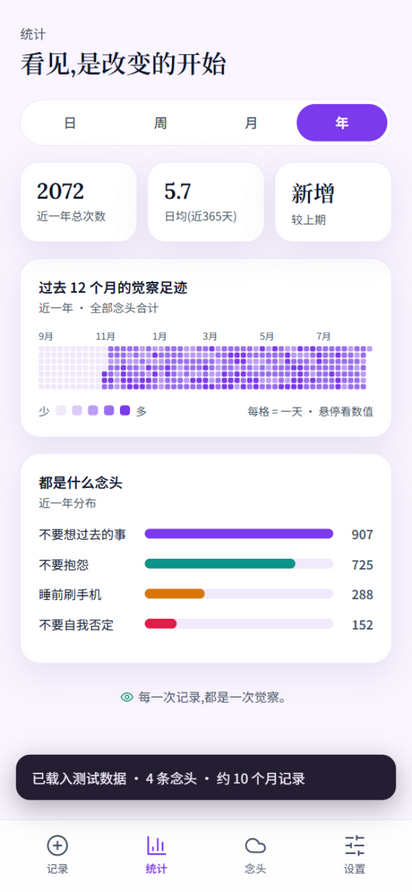
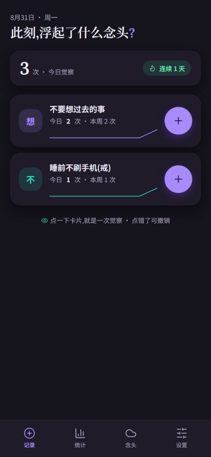

# 止念

一个很简单的念头计数器,纯 HTML / CSS / JavaScript,没有任何框架。它不跟念头较劲,也不讲大道理。念头浮起来了,回来点一下,就当觉察过了。





## 这个应用用来做什么

心里那些"不想要"的念头,越压越冒(心理学叫白熊效应)。与其忍,不如每次它浮现时轻轻记一笔——记下来不是为了忍住,而是为了在它再次浮现时,认得出它。日子久了,图表会告诉你它出现的规律。

- 点一下卡片就是一次觉察,点错了 5 秒内可撤销
- 日 / 周 / 月 / 年四种图表,看见频率和趋势,不评判好坏
- 念头可以重命名、暂停、归档,数据一直在
- 所有数据只存在这台设备的浏览器里,没有账号,不上传

## 怎么跑起来

**网页版**:双击 `index.html` 就能用,不需要安装任何东西。

也可以起个本地服务器(推荐,改代码刷新即生效):

```bash
python serve.py 8128
# 浏览器打开 http://127.0.0.1:8128/zhinian/index.html
```

在电脑浏览器里会居中显示成手机宽度;在安卓 Chrome 里可以「添加到主屏幕」,之后全屏运行,断网也能用。

## 功能一览

- 记录:念头卡片点一下 +1,涟漪动效,撤销,今日总览和连续天数
- 统计:日分布、周条形图、月折线图、年日历热力图,各念头占比,较上期变化
- 念头:添加(带预设建议)、重命名、暂停、归档、恢复、删除(有确认)
- 详情:单条念头的周图、年足迹、最近记录时间线,可以删掉单条记录
- 设置:深色模式三选、备份/恢复、导出/导入 .json、测试数据、重置
- 念头不会重复:添加和改名都会查重,撞名会温和提醒

## 隐私

所有数据保存在浏览器的 localStorage 里,没有服务器,没有账号,没有任何网络请求(字体除外)。换设备用「导出备份文件」装过去。

## 想看懂这个项目

| 文档 | 内容 |
|---|---|
| [docs/architecture.md](docs/architecture.md) | 代码结构、文件地图、数据流、想改东西从哪下手 |
| [docs/design-spec.md](docs/design-spec.md) | 产品设计文档(理念、信息架构、屏幕规格) |
| [docs/testing-report.md](docs/testing-report.md) | 测试报告:22 条用例,4 个缺陷全部修复闭环 |
| [docs/testing-cases.md](docs/testing-cases.md) | 用例执行记录 |
| [docs/bug-list.csv](docs/bug-list.csv) | 缺陷清单(根因定位到文件行级) |
| [docs/changelog.md](docs/changelog.md) | 更新日志 |
| [docs/prototype.html](docs/prototype.html) | 最初的单文件原型(留档) |

## 后续计划

- 字体本地化(摆脱 CDN)
- 添加念头自选颜色 / 图标
- 安卓 APK 打包

## License

[MIT](LICENSE)
